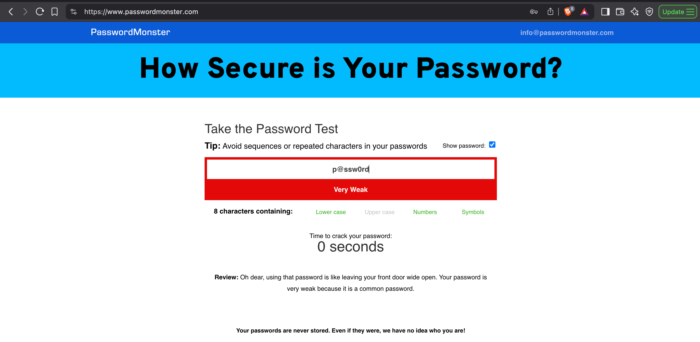
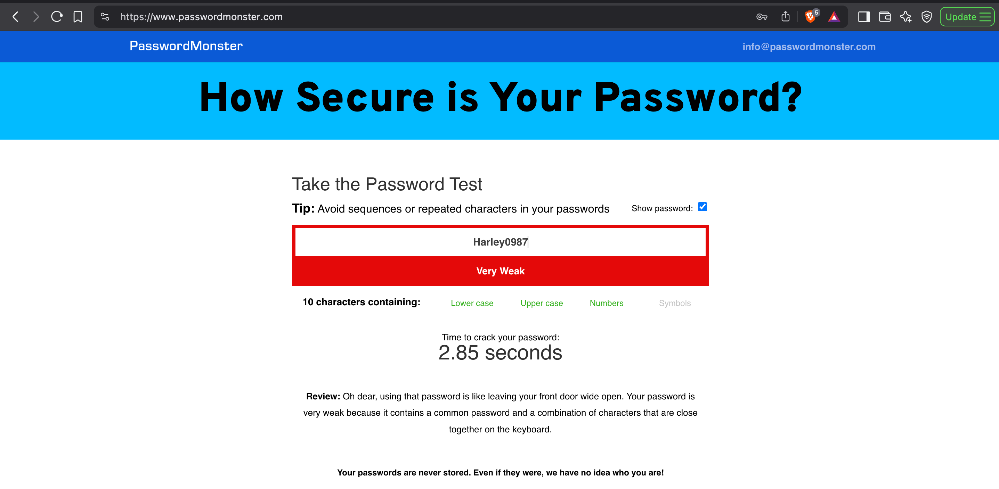
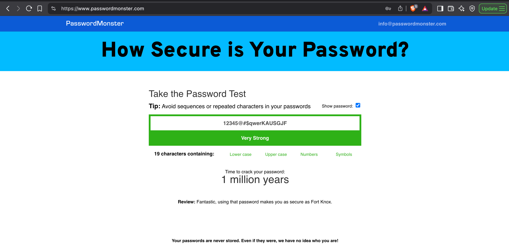
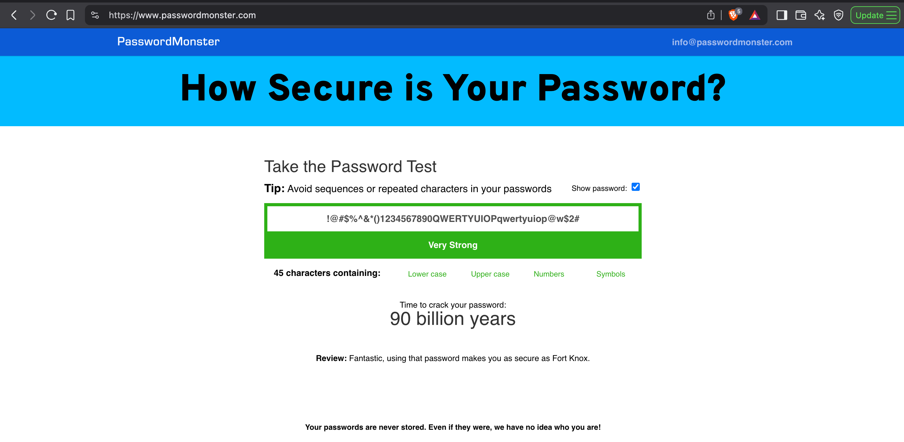

# 🔐 Password Strength Analysis Project

## 🧠 Objective

Understand what makes a password strong by analyzing password complexity and evaluating them using a password strength checker.

## 🛠️ Tasks

1. Create multiple passwords with varying levels of complexity.
2. Use combinations of uppercase, lowercase, numbers, symbols, and different lengths.
3. Test each password using [PasswordMonster.com](https://www.passwordmonster.com/).
4. Record feedback and security scores for each password.
5. Identify best practices for strong password creation.
6. Summarize tips based on evaluations.
7. Research common password attack methods (brute force, dictionary attacks).
8. Analyze how password complexity influences security.

---

## 🔎 Password Testing Results

### ❌ Weak Passwords

| Password     | Feedback | Screenshot |
|--------------|----------|------------|
| `admin@123`  | Very weak – contains a common password, dictionary word, and sequence. |  |
| `p@ssw0rd`   | Very weak – commonly used password. |  |
| `Lily1234`   | Very weak – includes a name and a common pattern. |  |
| `Harley0987` | Very weak – uses a name and common keyboard sequence. |  |

### ✅ Strong Passwords

| Password                          | Feedback | Screenshot |
|----------------------------------|----------|------------|
| `12345@#$qwerKAUSGJF`            | Very strong – described as "as secure as Fort Knox." |  |
| `!@#$%^&*()1234567890QWERTYUIOPqwertyuiop@w$2#` | Extremely strong – described as "as secure as Fort Knox." |  |

---

## 🖼️ Screenshots

Screenshots of password evaluations from PasswordMonster.com are included in the `/screenshots` folder for reference.

---

## 💡 Key Learnings

### Tips for Creating Strong Passwords

- Use a combination of **uppercase**, **lowercase**, **numbers**, and **symbols**.
- Avoid **dictionary words**, **names**, or **common patterns**.
- Create passwords with a **length of 16+ characters**.
- Do not reuse passwords across multiple sites.
- Avoid **keyboard patterns** (e.g., `123456`, `qwerty`).

### Password Attack Summary

- **Brute Force Attack**: Tries every possible combination. Long, complex passwords take exponentially longer to crack.
- **Dictionary Attack**: Uses precompiled lists of common words and variations. Avoid using recognizable words to stay protected.

---

## 🧪 Tools Used

- [PasswordMonster.com](https://www.passwordmonster.com/)

---

## 📜 License

This project is licensed under the [MIT License](LICENSE).
